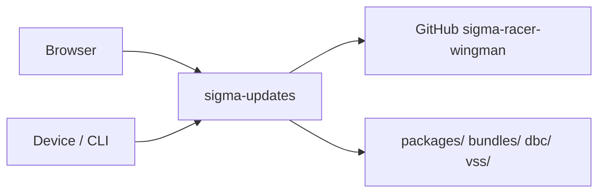

# sigma-updates architecture

`sigma-updates` publishes Debian packages and RAUC OTA bundle metadata for Sigma Racer Wingman. It mirrors DBC and VSS schema trees from GitHub, serves versioned download APIs, and exposes an HTML index for operators.

## Context

This service owns no database. Package, bundle, and mirrored schema files live on the container filesystem under configurable directories.

## Runtime shape

The `sigma-updates` binary validates configuration, builds an in-memory `Catalog` with dev defaults where applicable, spawns a background DBC/VSS GitHub sync task, then hands `sigma_updates::routes(catalog)` to `sigma_theme::warp::serve`. The theme crate supplies the Warp server, shared static assets, security headers, and the listen address from `PORT`.

Health routes register without a PostgreSQL pool. Publish and delete operations on bundles require `SIGMA_INTERNAL_TOKEN`.

## Request flow

`routes()` combines HTML index pages from `web.rs` with JSON and upload handlers from `api.rs`. `sigma_theme::warp::site_routes` supplies `/up`, static assets, and error recovery.

The web UI lists packages, mirrored DBC/VSS trees, and RAUC channels. The API serves `/v1/packages`, `/v1/dbc`, `/v1/vss`, `/v1/channels`, and authenticated bundle publish, download, and delete. A background task re-mirrors schemas from GitHub on the configured interval.

## Code map

| Path | Responsibility |
| --- | --- |
| `src/main.rs` | Validates config, starts sync task, and launches the server. |
| `src/lib.rs` | Assembles web UI, API, health, theme, and CSP routes. |
| `src/config.rs` | Reads public URLs, filesystem paths, and GitHub mirror settings. |
| `src/catalog.rs` | RAUC channel metadata and dev version defaults. |
| `src/packages/` | `.deb` catalog indexing and serving. |
| `src/dbc/` | DBC mirror storage and GitHub sync. |
| `src/vss/` | VSS mirror storage. |
| `src/bundles.rs` | RAUC bundle read, write, and delete. |
| `src/api.rs` | JSON, upload, and download handlers. |
| `src/web.rs` | HTML operator index. |
| `client/`, `cli/`, `deb/` | Push, list, and deb-parsing workspace crates. |

## Data

Runtime state is filesystem-backed: `packages/` holds `.deb` files, `bundles/` holds RAUC channel directories, and `dbc/` / `vss/` hold read-only GitHub mirrors. Restart or redeploy refreshes in-memory catalog state from disk; DBC/VSS sync updates mirror directories on a timer.

## Configuration

| Environment variable | Purpose |
| --- | --- |
| `PORT` | Listen port supplied to the theme crate. |
| `UPDATES_PUBLIC_BASE_URL` | Public base URL of this service (bundle URLs and links). |
| `UPDATES_IDENTITY_PUBLIC_URL` | Identity BFF URL for navbar links and CSP `connect-src`. |
| `UPDATES_CONTACT_PUBLIC_URL` | Contact-service URL for the shared chrome. |
| `UPDATES_CART_PUBLIC_URL` | Cart-service URL for the shared chrome. |
| `UPDATES_PACKAGES_DIR` | Directory of published `.deb` files (default `./packages`). |
| `UPDATES_BUNDLES_DIR` | RAUC bundle store, one subdirectory per channel (default `./bundles`). |
| `UPDATES_DBC_DIR` | Local cache for mirrored DBC schemas (default `./dbc`). |
| `UPDATES_VSS_DIR` | Local cache for mirrored VSS files (default `./vss`). |
| `UPDATES_DBC_GITHUB_REPO` | GitHub `owner/repo` for schema mirrors (default `sigmatactical-org/sigma-racer-wingman`). |
| `UPDATES_DBC_GITHUB_PATH` | Repository path for DBC schemas (default `schemas/can`). |
| `UPDATES_VSS_GITHUB_PATH` | Repository path for VSS schemas (default `schemas/vss`). |
| `UPDATES_DBC_GITHUB_REF` | Git ref to mirror (default `main`). |
| `UPDATES_DBC_SYNC_SECS` | Interval between DBC/VSS mirror passes (default `300`). |
| `UPDATES_GITHUB_TOKEN` | Optional GitHub token for rate limits or private repos; falls back to unprefixed `GITHUB_TOKEN`. |

## Deployment

`Dockerfile` produces the `sigma-updates` image and bundles seed `packages/`, `dbc/`, and `vss/` content. The platform deployment is at `../platform/services/updates/base/deployment.yaml`; it exposes container port `8080` through `../platform/services/updates/base/service.yaml` on service port `80`.

The public VirtualService and environment overlays reside beside the base manifests under `../platform/services/updates/`. Production hostname and platform context are documented in [`../platform/README.md`](../platform/README.md).

## Testing

Run `cargo test -p sigma-updates` for unit tests across packages, DBC, bundles, and API modules. The workspace CLI supports `cargo run -p sigma-updates-cli -- list|check|push` for operator workflows.

## Design notes

- DBC and VSS are read-only mirrors; there is no publish API for schema files.
- `.deb` and RAUC bundles support authenticated publish and delete via internal token.
- Runtime image requires `liblzma` for `xz2` decompression.
